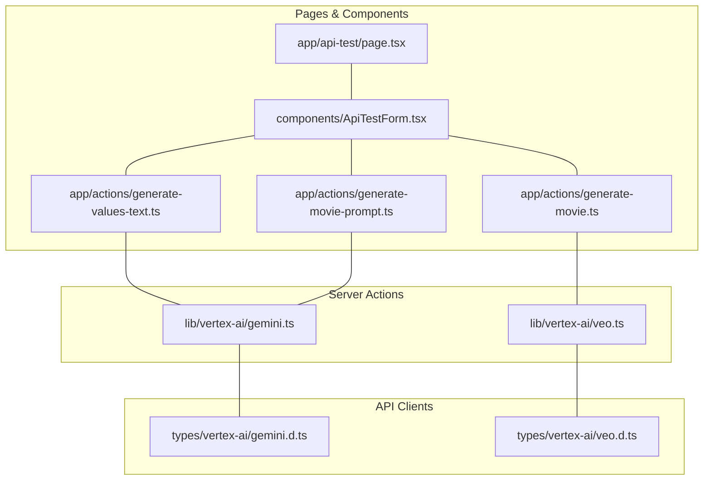

# API動作確認画面の構成計画

## 目的
テキスト生成APIとVeo2 APIを呼び出す動作確認のための簡易的な画面を実装する。

## APIエンドポイント
1. テキスト生成API（gemini-1.5-flash-002）
   - 価値観テキスト生成API
   - 動画用プロンプト生成API
2. 動画生成API（Veo2）
   - 価値観の動画生成API

## ディレクトリ構成
```
├── app/
│   ├── actions/
│   │   ├── generate-values-text.ts    # 価値観テキスト生成
│   │   ├── generate-movie-prompt.ts   # 動画用プロンプト生成
│   │   └── generate-movie.ts          # 動画生成
│   └── api-test/
│       └── page.tsx                   # API動作確認ページ
├── components/
│   └── ApiTestForm.tsx               # API動作確認フォーム
├── lib/
│   └── vertex-ai/
│       ├── gemini.ts                 # Geminiモデル用クライアント
│       └── veo.ts                    # Veo2モデル用クライアント
└── public/
│   └── videos/         # 生成した動画の保存場所
└── types/
    └── vertex-ai/
        ├── gemini.d.ts               # Gemini API型定義
        └── veo.d.ts                  # Veo API型定義
```

## コンポーネント構造


## 実装方針
1. まずはGemini APIクライアントと価値観テキスト生成の実装
   1. `lib/vertex-ai/gemini.ts` - Gemini APIクライアントの実装
   2. `types/vertex-ai/gemini.d.ts` - 型定義
   3. `app/actions/generate-values-text.ts` - Server Action
   4. `components/ApiTestForm.tsx` - 動作確認用フォーム
   5. `app/api-test/page.tsx` - フォームの配置

2. 次に動画用プロンプト生成APIの実装
   1. `app/actions/generate-movie-prompt.ts`
   2. フォームに機能追加

3. 最後に動画生成APIの実装
   1. `lib/vertex-ai/veo.ts`
   2. `types/vertex-ai/veo.d.ts`
   3. `app/actions/generate-movie.ts`
   4. フォームに機能追加

## API動作確認フォームの機能
- 3つのAPIそれぞれのテスト機能
- 各APIのテスト用の入力フォームとテスト実行ボタン
- レスポンス表示エリア
- シンプルなUI（最小限の機能）

## 注意点
- 保守性、拡張性、テストのしやすさよりも、動作確認の簡易さを優先
- Server ActionsでVertex AI APIを直接呼び出す
- 認証情報は適切に管理


## 動画保存方式

### publicディレクトリを使用する方式

メリット：
1. 実装が最もシンプル（直接URLでアクセス可能）
2. 追加の設定やルーティングが不要
3. ハッカソンの動作確認という目的に適している

デメリット：
1. Next.jsのベストプラクティスに反する
2. 本番環境では適さない

※ ハッカソンでの動作確認が目的のため、実装の簡易さを優先してpublicディレクトリを採用