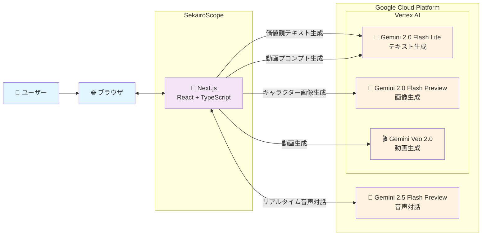

# SekairoScope - システム構成図

SekairoScopeアプリケーションの構成図です。生成AIを中心とした外部連携構成に焦点を当てています。

## システム構成図

## 主要な技術構成

### **フロントエンド・バックエンド**
- **Next.js (React + TypeScript)** - フルスタックアプリケーション、UI/UX、AI API連携

### **生成AI (Google Cloud Platform)**

| 機能 | API | 用途 |
|------|-----|------|
| 🤖 **テキスト生成** | Gemini 2.0 Flash Lite | 価値観テキスト、動画プロンプト生成 |
| 🎨 **画像生成** | Gemini 2.0 Flash Preview | キャラクターアバター画像生成 |
| 🎬 **動画生成** | Veo 2.0 | 価値観を表現する動画コンテンツ |
| 🎤 **音声対話** | Gemini 2.5 Flash Preview | リアルタイム音声チャット |

## データフロー詳細

1. **ユーザーインタラクション**
   - ブラウザ経由でNext.jsアプリケーションにアクセス
   - カードスワイプ、音声入力によるユーザー価値観の収集

2. **AI処理パイプライン**
   - 価値観データをGemini 2.0 Flash Liteでテキスト化
   - キャラクター画像をGemini 2.0 Flash Previewで生成
   - 動画プロンプトをテキスト生成AI経由でVeo 2.0に送信
   - リアルタイム音声対話はGemini 2.5 Flash Previewで処理

この構成により、ユーザーの価値観を多角的に可視化し、AIとのインタラクティブな対話体験を提供しています。

